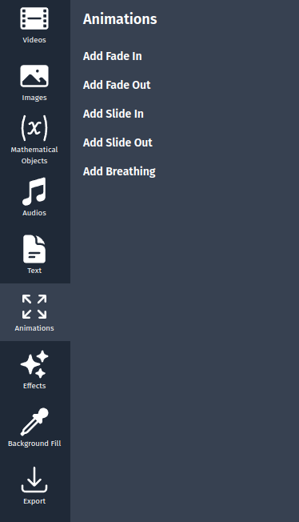
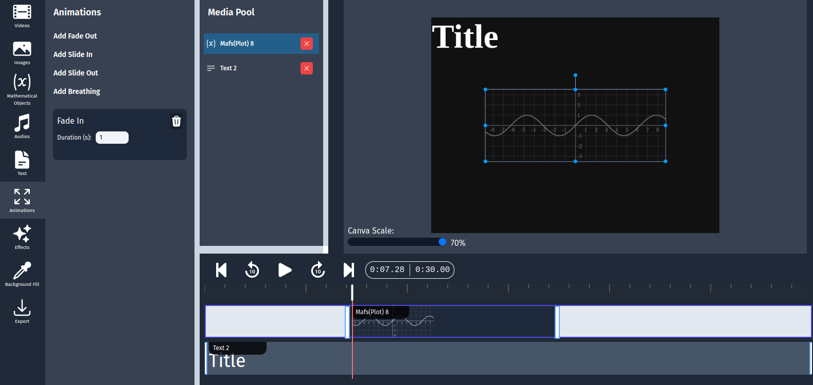
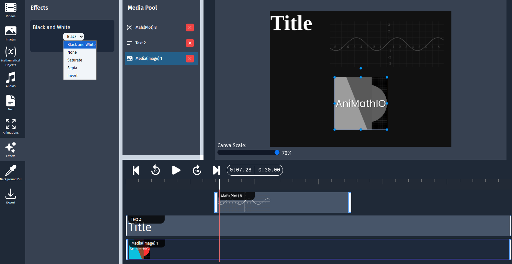

# Creating Complex Animations

While basic animations in AniMathIO are straightforward, creating complex, multi-stage animations requires some planning and advanced techniques. This guide will help you create sophisticated mathematical animations that build up concepts step by step.

## Understanding Animation Types in AniMathIO

AniMathIO offers several ways to create animations:

1. **Transition animations**: Controlling when elements appear and disappear (Fade, Slide, etc.)
2. **Motion animations**: Such as breathing
3. **Combined animations**: Combining multiple animation types

## Working with the Animations Panel

The Animations panel is your primary tool for creating complex animations:

1. In the left sidebar, click on the **Animations** option
2. Here you'll find different animation types that you can apply to your elements

## Creating a Transition Animation

Let's start with a simple transition animation:

1. First, add an element to your canvas (like a point, shape, or text)
2. In the left sidebar, click on **Animations**
3. Select the **Add Fade In** animation type
4. Set the **duration** of the animation, this will determine how long it takes for the element to appear

Your element will now fade in over the specified duration.

## Coordinating Multiple Animations

Complex explanations often require multiple elements animating in coordination:

### Example: Animating a Vector Addition

1. Add two vectors (A and B) to your canvas
2. Add a third vector (C) that will represent A+B
3. Create a transition animation for vector A
4. Create a transition animation for vector B:
   - Set it to appear after vector A's animation completes
5. Create another transition animation for vector C:
   - Set it to appear after vector B's animation completes
   - Configure it to represent the sum of vectors A and B

## Creating Sequential Animations

To build up complex concepts step by step:

1. Break down your explanation into distinct steps
2. Create separate animations for each step
3. Set the timing so each animation starts after the previous one completes
4. Use the timeline to fine-tune the timing between steps

### Example: Animating a Proof

1. Add the initial equation as a LaTeX element
2. Add subsequent steps as separate LaTeX elements
3. Use transition animations to show the transformation from one step to the next
4. Coordinate with text elements explaining each step

## Using Effects for Emphasis

The Effects panel offers additional ways to emphasize important elements:

1. In the left sidebar, click on **Effects**
2. Select an effect type (black and white, sepia, invert etc.)
3. Choose the element to apply the effect to

## Tips for Creating Effective Complex Animations

- **Storyboard first**: Plan your animation sequence before building in AniMathIO
- **Build incrementally**: Create and test one animation at a time
- **Use consistent timing**: Maintain rhythm in your animations for better comprehension
- **Provide visual cues**: Use effects to direct attention to important elements
- **Test with audience**: Get feedback on clarity and pacing from potential viewers

## Next Steps

Now that you understand how to create complex animations, learn how to [work with multimedia](./working-with-multimedia.md) to incorporate images, videos, and audio into your mathematical presentations.
