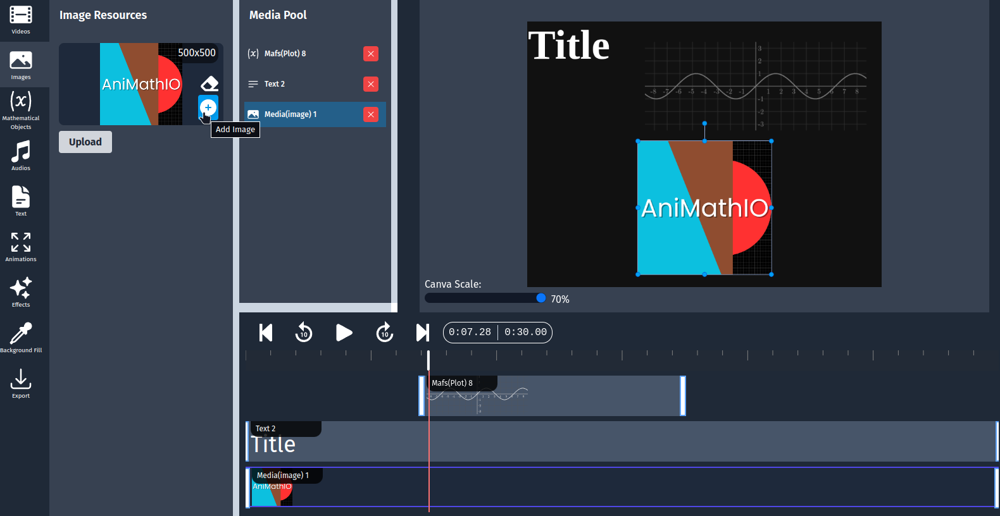
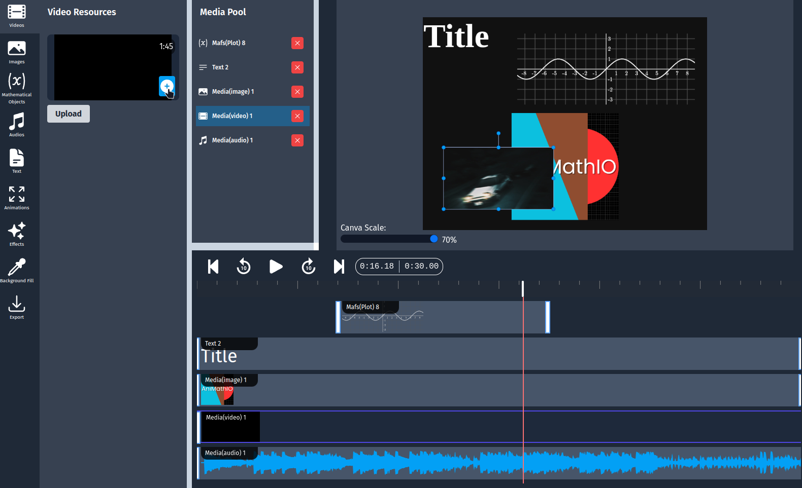
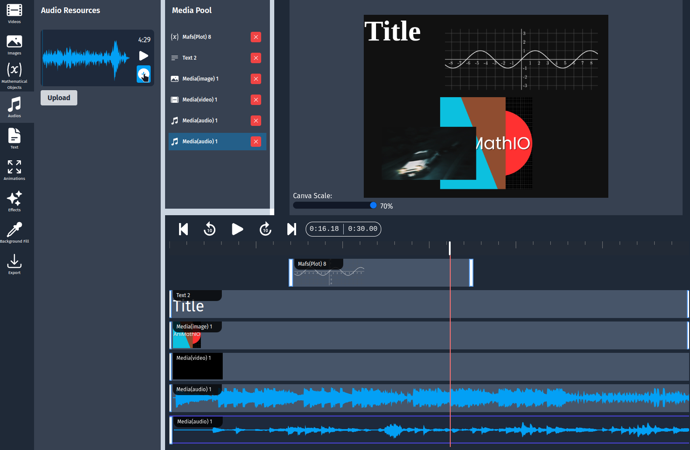

# Working with Multimedia

AniMathIO allows you to enhance your mathematical animations with multimedia elements such as images, videos, and audio. This guide will show you how to incorporate these elements effectively.

## Working with Images

Images can be used to illustrate concepts, provide context, or add visual interest to your animations.

### Adding Images to Your Project

1. In the left sidebar, click on the **Images** option
2. Click the **Upload Image** button
3. Select an image file from your computer
4. Once uploaded, the image will appear in your **Image Resources** section
5. Here you can add the image to the media pool, timeline and canvas by clicking the **+** button
6. You can also choose the **eraser buttton** to remove the background of the image
   - This will take a bit of time to process
   - You can click the eraser button at any time, and it will remove the background for the image in the whole project

### Positioning and Resizing Images

After adding an image to your canvas:

1. **Drag** the image to position it
2. **Resize** by dragging the corners or edges
3. Use the timeline to control when the image appears and disappears

### Image Best Practices

- **Use high-quality images**: Ensure your images are clear and professional
- **Consider transparency**: PNG images with transparent backgrounds work best when overlaying on other elements
- **Size appropriately**: Resize images to complement rather than overwhelm mathematical content
- **Maintain aspect ratio**: Avoid stretching images disproportionately

## Incorporating Videos

Videos can demonstrate dynamic concepts or provide real-world context for mathematical principles.

### Adding Videos to Your Project

1. In the left sidebar, click on the **Videos** option
2. Click the **Upload Video** button
3. Select a video file from your computer
4. Once uploaded, the video will appear in your **Video Resources** section
5. Here you can add the video to the media pool, timeline and canvas by clicking the **+** button

### Controlling Video Playback

When working with videos, you can:

1. **Set the start and end times**: Trim the video to show only the relevant portion
2. **Remove the audio**: You can delete the audio track from the video in the media pool or in the canvas by using the `ctrl+delete` keyboard shortcut

## Adding Audio

Audio can provide narration, explanations, or background music to enhance your animation.

### Adding Audio Files

1. In the left sidebar, click on the **Audios** option
2. Click the **Upload Audio** button
3. Select an audio file from your computer
4. Once uploaded, the audio will appear in your **Audio Resources** section
5. Here you can add the audio to the media pool, timeline and canvas by clicking the **+** button
6. Or you can preview the audio by clicking the **Play** button

## Combining Multimedia with Mathematical Elements

The power of AniMathIO comes from combining multimedia with mathematical components:

### Example: Creating an Interactive Lesson

1. Add a video demonstrating a real-world phenomenon
2. Overlay mathematical elements (graphs, equations) that explain the phenomenon
3. Add audio narration explaining the connection or add background music
4. Use animations to synchronize the mathematical elements with specific moments in the video

## Tips for Effective Multimedia Use

- **Balance is key**: Don't overwhelm viewers with too many elements at once
- **Purpose-driven**: Each multimedia element should serve a specific educational purpose
- **Synchronize carefully**: Ensure mathematical elements appear in sync with related audio or video
- **Consider file size**: Multiple high-resolution images or videos can make your project large
- **Check compatibility**: Test with common media formats (JPG, PNG, MP4, MP3)

## Next Steps

Now that you know how to work with multimedia elements, lets see the [conclusion](./conclusion.md) of this guide!
