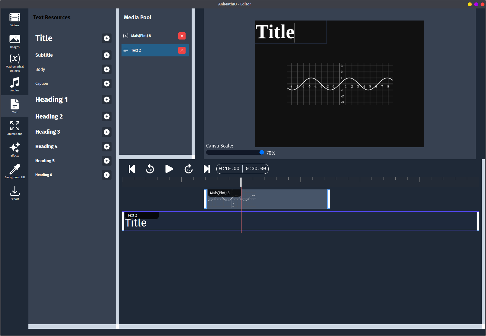
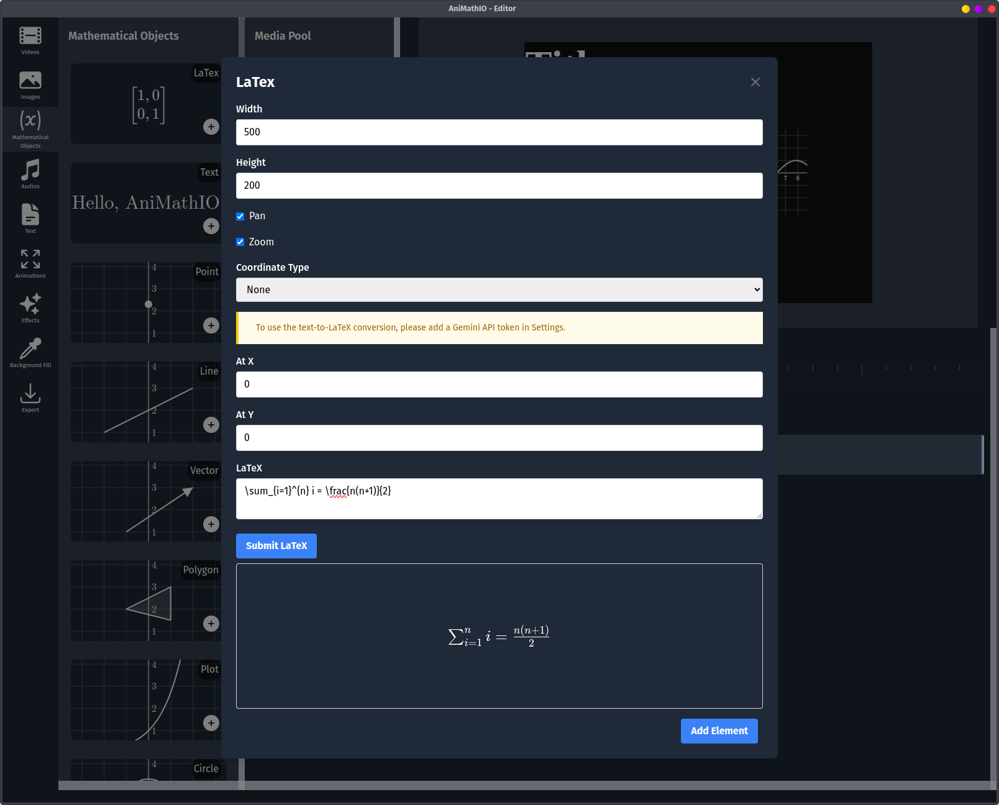
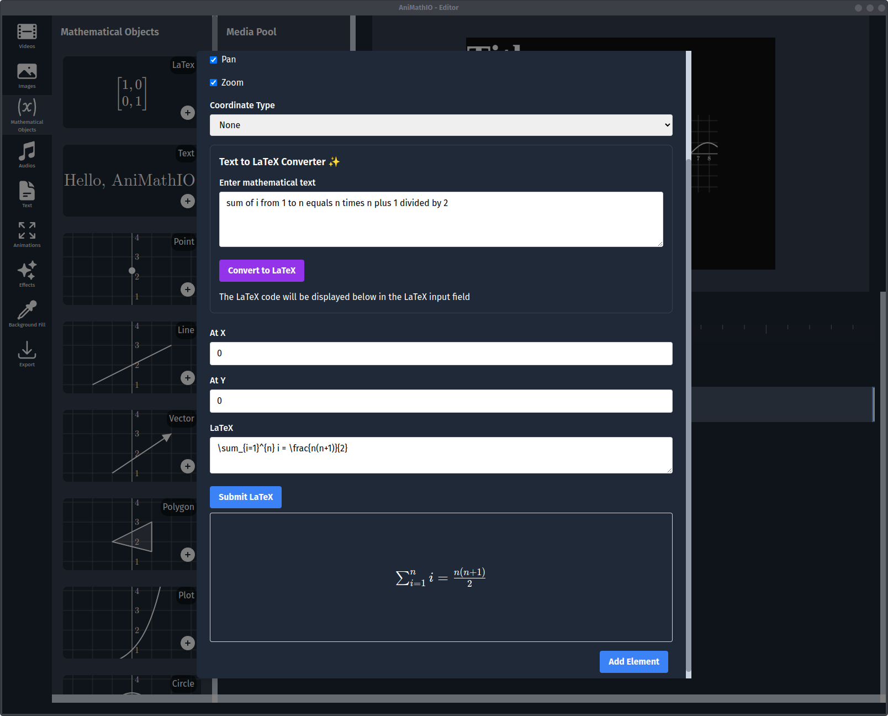

# Adding Text and LaTeX

Text and mathematical formulas are crucial for explaining concepts in educational videos. AniMathIO makes it easy to add both regular text and LaTeX mathematical notation to your projects.

## Adding Regular Text

For basic explanations, titles, or labels, you can add simple text elements:

1. In the left sidebar, click on the **Text** option
2. Select one of the available text sizes (ex. Title, Subtitle, Heading 1, etc.) and click the **+** button
3. Now a text element will appear in the media pool, timeline and canvas
4. Duble-click the text element to enter the text content in the input field
5. Move the text element to the desired position on the canvas and resize it as needed

## Working with LaTeX

LaTeX is the standard for displaying mathematical notation. AniMathIO provides two ways to add LaTeX formulas:

### Method 1: Using the Mathematical Objects Panel

1. In the left sidebar, click on **Mathematical Objects**
2. Select **LaTeX** from the components list
3. Configure the properties:
   - Set the **width** and **height** of the component (this sets the viewport size)
   - Choose the **coordinates type** (Cartesian, Polar, None)
   - Set the **x** and **y** coordinates
   - Optionally disable **pan and zoom** if you want a fixed view
4. Enter your LaTeX code in the **LaTeX** input field (e.g., `\sum_{i=1}^{n} i = \frac{n(n+1)}{2}`)
5. Sumbit the LaTeX code for evaluation via the **Submit LaTeX** button
6. Click the **Add Element** button

### Method 2: Using Text-to-LaTeX Conversion (Requires Gemini API Key)

For users who are not familiar with LaTeX syntax, AniMathIO offers an AI-powered conversion feature:

1. In the Settings menu, set and save your Gemini 2.0 Flash API key
2. In the left sidebar, click on **Mathematical Objects**
3. Select **LaTeX** from the components list
4. Now an extra input field will appear for **Text-to-LaTeX** option
5. Type in plain English (e.g., "sum of i from 1 to n equals n times n plus 1 divided by 2")
6. Click **Convert to LaTeX** to generate the LaTeX code
7. Review and edit the generated LaTeX if needed
8. Sumbit the LaTeX code for evaluation via the **Submit LaTeX** button
9. Click the **Add Element** button

## Positioning and Styling Text Elements

After adding text or LaTeX to your canvas:

1. **Position** the element by dragging it to the desired location
2. **Resize** by dragging the corners or edges
3. **Adjust visibility** timing using the timeline to control when text appears and disappears

## Best Practices for Text and LaTeX

- **Keep it concise**: Use short phrases and clear mathematical notation
- **Coordinate timing**: Make text appear when relevant to the visual elements it describes
- **Consider spacing**: Leave enough space around formulas for readability
- **Break down complex formulas**: Introduce complex equations step by step rather than all at once

## Example: Creating a Step-by-Step Proof

To create a step-by-step mathematical proof:

1. Add the initial formula using LaTeX
2. Add subsequent steps as separate LaTeX elements
3. In the timeline, arrange these elements to appear sequentially
4. Add explanatory text elements between formula steps
5. Coordinate the timing so each step appears after the explanation

## Next Steps

Now that you can add text and mathematical formulas to your project, let's learn how to [export your project](./exporting-your-project.md) as a video or save it for future editing.
