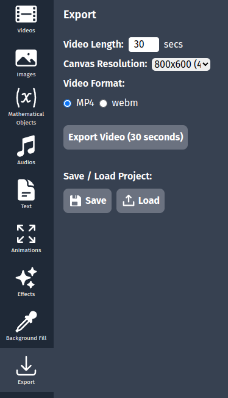

# Exporting Your Project

After creating your mathematical animation, you'll want to export it as a video file or save your project for future editing. This guide explains the export options in AniMathIO.

## Saving Your Project

It's important to save your work regularly. AniMathIO projects are saved in the `.animathio` format, which preserves all your elements, settings, and timeline information:

1. In the left sidebar, click on the **Export** option
2. In the **Save/Load Project** section, click the **Save** button
3. Choose a location and filename for your project
4. Click **Save**

## Loading a Saved Project

To continue working on a previously saved project:

1. In the left sidebar, click on the **Export** option
2. In the **Save/Load Project** section, click the **Load** button
3. Navigate to your saved `.animathio` file
4. Click **Open**

## Setting Video Export Parameters

Before exporting your animation as a video, you can configure several important parameters:

1. In the left sidebar, click on the **Export** option
2. Configure the export settings:
   - **Video Length**: Set the total duration of your video in seconds
   - **Aspect Ratio**: Choose from common aspect ratios ( 1920x1080 (16:9 - Full HD), 800x600(4:3 - SD), etc.)
   - **Video Format**: Select your preferred format (MP4 or webm)

## Exporting as Video

Once you've configured your export settings:

1. In the **Export Video** section, click the **Export Video** button
2. Choose a location and filename for your video
3. Click **Save**
4. A progress indicator will appear showing the export progress
5. Once complete, you can find your video at the specified location

## Export Tips and Best Practices

- **Check the timeline**: Before exporting, make sure all your elements have the correct timing
- **Preview your animation**: Use the playback controls to review your animation before export
- **Consider file size**: Higher quality and longer videos will result in larger file sizes
- **Test a short segment**: If you're unsure about settings, try exporting a short segment first
- **Save project before export**: Always save your project file before exporting to video

## Video Formats Explained

- **MP4**: The most widely compatible format, good for sharing online or presenting
- **WebM**: Offers good compression and quality, faster to export, ideal for web embedding but less compatible than MP4

## Troubleshooting Export Issues

If you encounter issues during export:

- Ensure you have sufficient disk space
- Close other resource-intensive applications
- For large or complex projects, consider increasing the quality setting
- If export fails repeatedly, try saving your project and restarting AniMathIO

## Congratulations 🎉

You've completed the basic tutorials for AniMathIO! You now know how to:

- Navigate the interface
- Work with mathematical components
- Manage the timeline and animations
- Add text and LaTeX formulas
- Export your projects

For more advanced techniques and features, check out the [Advanced Tutorials](../category/tutorial-advanced-features) section.
