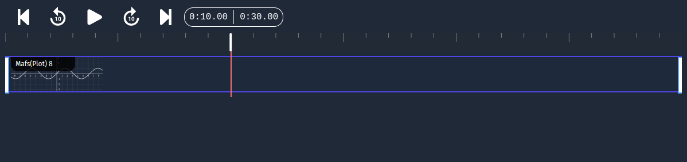
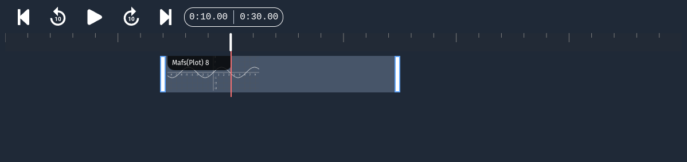

# Managing Timeline and Animations

The timeline is where the magic happens in AniMathIO - it's where you control when elements appear, disappear, and how they animate over time. This guide will help you master timeline controls and create smooth animations.

## Understanding the Timeline

The timeline is located at the bottom of the interface and displays all the elements in your project along a time axis:

### Key Timeline Components

- **Navigation Controls**: Buttons to play/pause and jump to different points in time
- **Time Ruler**: Shows the duration of your project in seconds
- **Playhead/Indicator**: The red vertical line indicating the current position in time
- **Timeline Tracks**: Each element in your project has its own track
- **Element Clips**: The colored bars representing when each element is visible

## Basic Timeline Navigation

- **Play/Pause**: Click the play button or press the spacebar to start/stop playback
- **Jump to Time**: Click anywhere on the time ruler to jump to that position
- **Step Forward/Backward**: Use the arrow buttons or arrow keys to move frame by frame
- **Jump to Start/End**: Use the jump buttons to move to the beginning or end of your project

## Controlling Element Timing

Each element in your project appears as a bar on the timeline. You can control when elements appear and disappear:

1. **Select** an element's bar on the timeline
2. **Drag the edges** of the bar to change the duration of the element's appearance
3. **Drag** the entire bar to change when the element appears

### Example: Creating a Sequential Appearance

To make mathematical objects appear one after another:

1. Add several mathematical components to your project
2. In the timeline, arrange their bars sequentially:
   - Set the first element to appear at the beginning
   - Set the second element to appear a few seconds later
   - Continue this pattern for all elements

## Setting the Project Duration

To adjust the total length of your animation:

1. Navigate to the **Export** section in the left sidebar
2. Set your desired video length using the video length control
3. The timeline will adjust to reflect the new total duration

## Previewing Your Animation

Use the timeline controls to preview your animation at any stage:

1. **Play** the animation from the beginning to see the full sequence
2. **Scrub** through the timeline by dragging the playhead to check specific moments
3. **Adjust** element timing as needed based on your preview

## Tips for Effective Timeline Management

- **Use Consistent Timing**: For educational videos, maintain consistent timing between steps to help viewers follow along
- **Save Versions**: Before making major timeline changes, save a version of your project
- **Test Frequently**: Preview your animation often to ensure smooth flow and appropriate timing

## Next Steps

Now that you understand how to control the timing of your elements, let's learn how to [add text and LaTeX formulas](./adding-text-and-latex.md) to explain the mathematical concepts in your animations.
