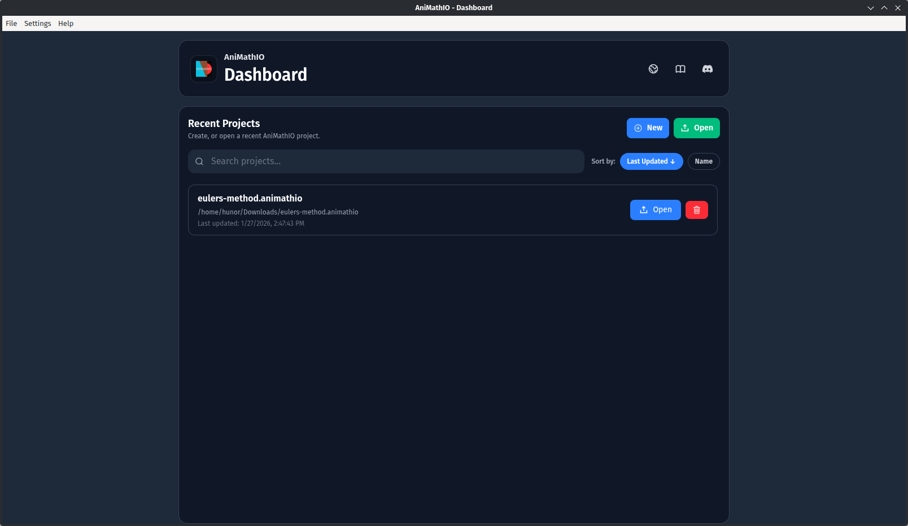
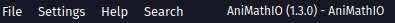
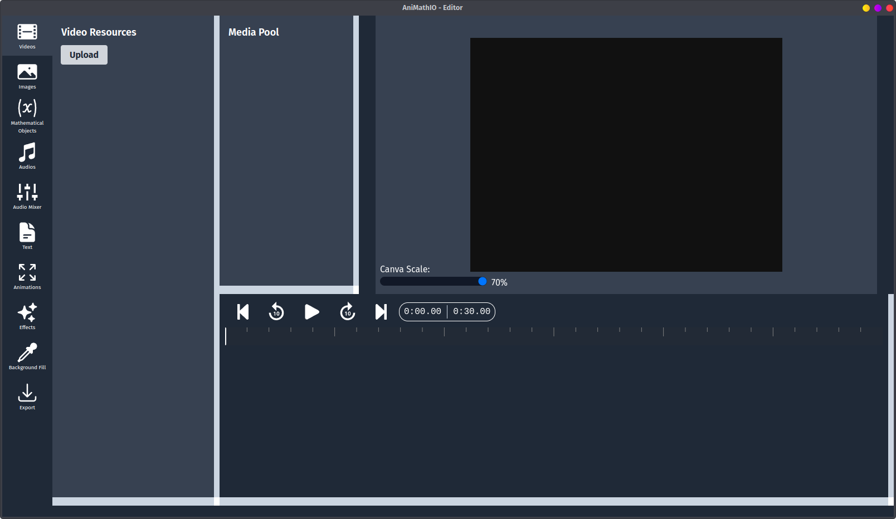

# Understanding the Interface

Let's explore the AniMathIO interface to help you navigate and use the software effectively.

## Main Layout

### Dashboard

When you first launch AniMathIO, you'll see the **dashboard** where you can view recent projects, create new ones, or open existing projects. After selecting or creating a project, you'll enter the **editor interface** described below.

### Editor Interface
AniMathIO's interface is designed with clarity and functionality in mind, divided into several key areas:

### Menu Bar

- **File**: Quit the application
- **Settings**: Configure the application theme and Gemini API settings, view keyboard shortcuts, and optionally enable the local MCP server for [AI agent integration](../tutorial-advanced/ai-agent-integration.md). MCP is disabled by default; Settings provides the endpoint URL and authentication token for your client. Your preferences are saved for future sessions.
- **Help**: From here you can access the documentation, the website and the community Discord server

### Left Sidebar

The left sidebar contains all the tools and components you'll need to create your mathematical videos:

- **Videos**: Here you can upload and manage your videos
- **Images**: Import and manage your images
- **Mathematical Objects**: Access various mathematical components like points, lines, functions, and more
- **Audios**: Import and manage your audio files
- **Audio Mixer**: Control the volume of your audio files
- **Text**: Create and manage text elements
- **Animations**: Create and manage animations
- **Effects**: Apply various effects to your images and videos
- **Background Fill**: Customize the background color
- **Export**: Set video lenght, aspect ratio, format. Here you can save/save as your project or render it as a video after you're done
- **Manim Import**: Paste or load a Manim Community Python scene and turn it into editable timeline elements — see [Importing Manim Scenes](../tutorial-advanced/importing-manim-scenes.md)

### Secondary Left Sidebar - Media Pool

- Here you can see, and delete the active elements in your project that are also present in the canvas and the timeline

### Canvas

The central area is your canvas - this is where you'll see your creation take shape:

- **Drag and resize** elements directly on the canvas
  - You can also move the elements using the `ctrl + arrow keys` keyboard shortcut, and remove elements using the `ctrl + delete` keyboard shortcut
- **Preview** how your animation will look in real-time

### Timeline

The bottom section contains the timeline where you can:

- Control the **timing** of each element's appearance and animations
- **Preview** the animation in real-time, you can see where the current time is by the red indicator line
- Jump forward and backward in time using the `arrow keys` or the buttons
- Jump to the beginning and end of the animation using the buttons

## Next Steps

Now that you're familiar with the interface, let's learn how to work with [mathematical components](./working-with-mathematical-components.md) to create your first animation.
