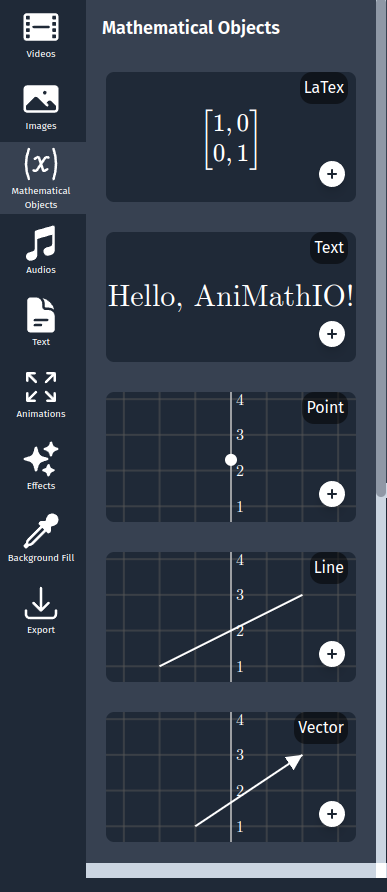
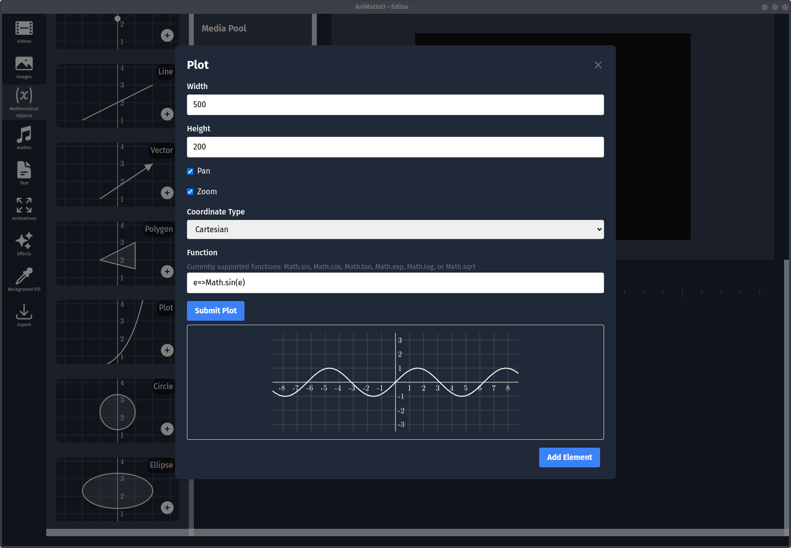
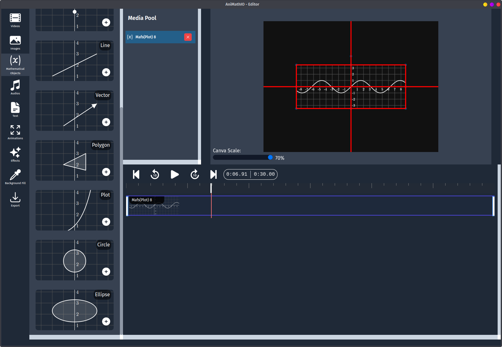

# Working with Mathematical Components

Mathematical components are the building blocks of your animations in AniMathIO. This guide will walk you through adding and customizing these components.

## Accessing Mathematical Components

1. In the left sidebar, click on the **Mathematical Objects** option
2. Browse through the available components:
   - LaTex
   - Text
   - Point
   - Line
   - Vector
   - Polygon
   - Plot
   - Circle
   - Ellipse
  

## Adding a Basic Component: Point

Let's start with something simple - adding a point to your canvas:

1. Click on **Mathematical Objects** in the left sidebar
2. Select **Point** from the available components
3. Configure the point properties:
   - Set the **width** and **height** of the component (this sets the viewport size)
   - Choose the **coordinates type** (Cartesian, Polar, None)
   - Set the **x** and **y** coordinates
   - Optionally disable **pan and zoom** if you want a fixed view
4. Click the **Add Element** button

Your point will now appear on the canvas, in the media pool, and in the timeline.

## Adding a Plot

Let's try something more complex - a function plot:

1. Click on **Mathematical Objects** in the left sidebar
2. Select **Plot** from the available components
3. Configure the function properties:
   - Set the **width** and **height** of the viewport
   - Enter your function in the **function** field (e.g., `e=>Math.exp(e)` or `e=>Math.sin(e)`)
   - Sumbit the plot for evaluation via the **Submit Plot** button
4. Click the **Add Element** button

## Customizing Components

After adding a component to the canvas, you can:

1. **Resize** the component by dragging the corners or edges
2. **Reposition** the component by dragging it around the canvas (or using `ctrl + arrow keys`)

## Tips for Working with Mathematical Components

- **Coordinate Systems**: When adding mathematical components, think about whether you want them in the same coordinate system or separate ones
- **Visibility**: You can control when components appear or disappear using the timeline
- **Combinations**: Create complex visualizations by combining multiple components
- **Precision**: Use the exact coordinate inputs rather than dragging for precise positioning

## Working with Multiple Components

To create meaningful mathematical visualizations, you'll often need multiple components working together:

1. Add a coordinate system first to serve as a reference
2. Add points, lines, or functions that relate to each other
3. Position them appropriately to demonstrate the mathematical concept
4. Use the timeline to control the sequence of their appearance

## Next Steps

Now that you can add and customize mathematical components, let's learn how to [manage the timeline and create animations](./managing-timeline-and-animations) to bring your mathematical concepts to life.
